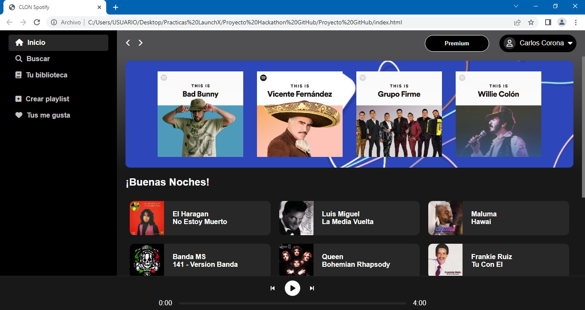
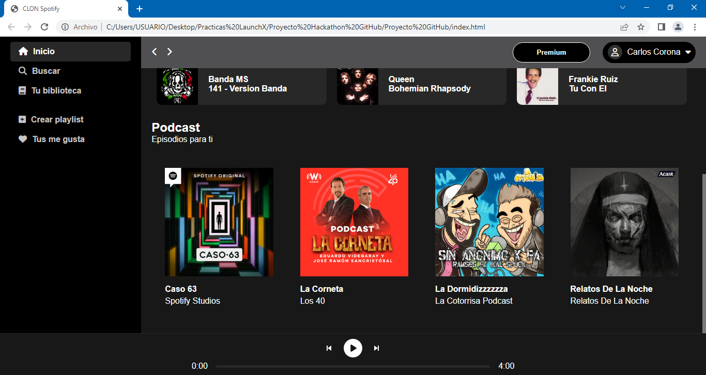

# Proyecto Hackathon GitHub :computer: :rocket:
## CLON de Spotify :musical_note:
El proyecto que presentare para el hackathon de GitHub, es un clon de Spotify, decidi realizar este proyecto
por que me parecio muy interesante y divertido de hacer, entiendo que es un proyecto que mucha gente ya a realizado, 
sin embargo yo quise intentarlo.

El proyecto "Clon de Spotify" esta maquetado con HTML y CSS, por temas de tiempo y demas cosas no pude continuar con la parte del JavaScript, aunque como reto personal seguire trabajando con el proyecto para que no solo sea una pagina estatica. 

Gracias al curso de LaunchX/FrontEnd es que pude realizar este proyecto y como mencione, pretendo seguir trabajando con la pagina web, es un reto personal que quiero terminar. 

## Te dejo algunas capturas de pantalla del proyecto

***Tambien puedes ir al link directo del proyecto, ¡vamos velo tu mismo! :eyes: :point_right: [LINK](https://clondespotify.azurewebsites.net)***

